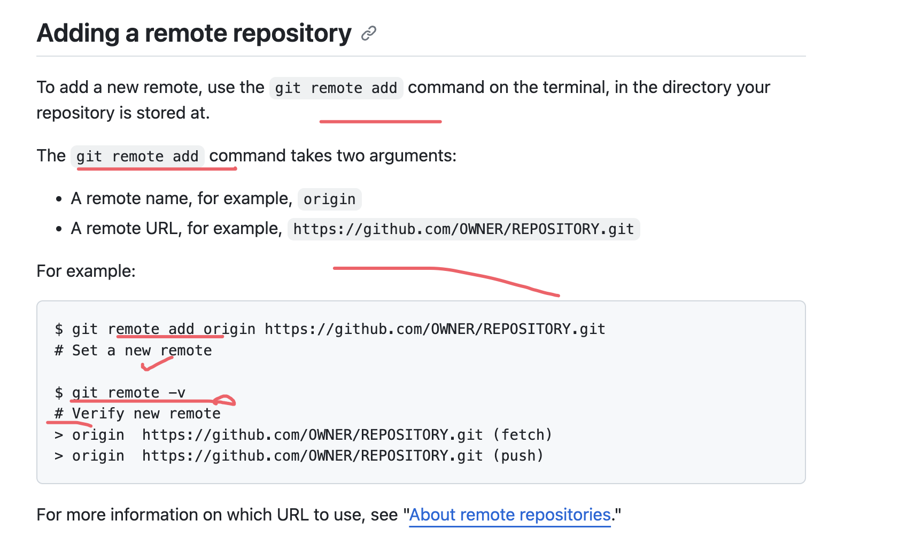

[# About remote repositories](https://docs.github.com/en/get-started/getting-started-with-git/about-remote-repositories)

>GitHub's collaborative approach to development depends on publishing commits from your local repository to GitHub for other people to view, fetch, and update.

You can only push to two types of URL addresses:

An HTTPS URL like https://github.com/user/repo.git
An SSH URL, like git@github.com:user/repo.git
Git associates a remote URL with a name, and **our default remote is usually called *origin*.**
//
An HTTPS URL like https://github.com/user/repo.git
An SSH URL, like git@github.com:user/repo.git
Git associates a remote URL with a name, and your default remote is  usually called origin.

You can use the git remote add command to match a remote URL with a name. For example, you'd type the following in the command line:

git remote add origin <REMOTE_URL>
```
git remote add origin <remote_url>

```
You can use the command git remote set-url to change a remote's URL.
You can use the command git remote set-url to change a remote's URL

//When you git clone, git fetch, git pull, or git push to a remote repository using HTTPS URLs on the command line, Git will ask for your GitHub username and password.

When you git clone, git fetch, git pull, or git push to a remote repository using HTTPS URLs on the command line,
Git will ask for your GitHub username and password.

## Managing remote repositories

Learn to work with your local repositories on your computer and remote repositories hosted on Github.



How to fix this , remember 
```
$ git remote add origin https://github.com/octocat/Spoon-Knife.git
> fatal: remote origin already exists.
```
-[!notice]
-Tip: For information on the difference between HTTPS and SSH URLs, see "About remote repositories."
for information on the difference between HTTPS and SSH URLs, see "About remote repositories."
